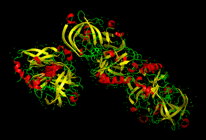
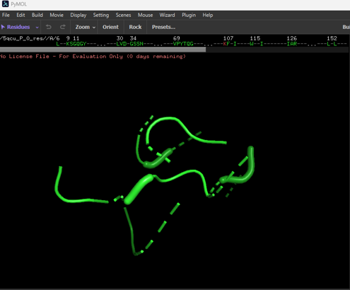
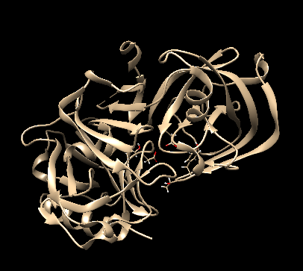
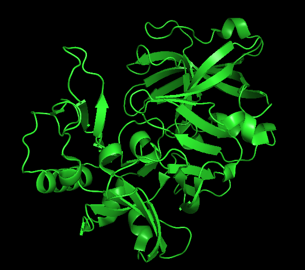

Project Overview: This project involves the retrieval, binding pocket prediction, and structural preparation of the BACE complex for in silico drug discovery

The 3D structure of Beta secretase (BACE) protein imported from Protein Data Bank into PyMol. The pdb id 5QCU was chosen becuase of its resolution 1.95 A. Lower resolutions (<2A) helps to visualize individual atoms clearly. 2-2.5A provides good detail but >3A makes it harder to place atoms precisely. PyMol is a tool used for visualizing secondary structures, identify binding pockets visually.

*Figure 1: Beta-secretase protein structure visualized in PyMol.*

The binding pockets on the protein was detected using DoG site scorer program in Protein Plus (https://proteins.plus/). The pdb structure was uploaded to Proteins plus and binding pocket with p_val = 0 was identified in the chain A. 

*Figure 2: Binding site detection in Chain A using the DoGsite scorer on Proteins Plus.*

Next, the protein pdb structure was uploaded to Chimera to prepare the protein for docking. Chains B and C, the co-crystallized ligands and the water molecules were removed. The structure was saved in a dockprep format. This preparation is important to add any missing atoms, assign charges, remove bound ligands and water molecules.
### Protein Preparation Results
| Before Cleaning | After Dockprep |
| :---: | :---: |
|  |  |
| *Initial 5QCU complex with water, ligands, and extra chains.* | *Final prepared Chain A isolated and cleaned in Chimera.* |

## Acknowledgments
This project was completed as part of the 3-Week Virtual Research Training in CADD (https://www.linkedin.com/company/the-insilico-lab/posts/?feedView=all) organized by **The InSilico Lab**. 
