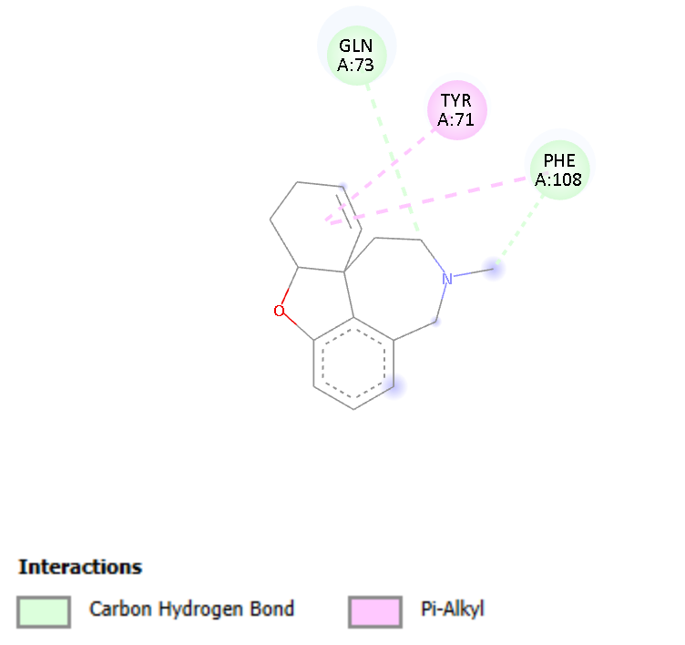
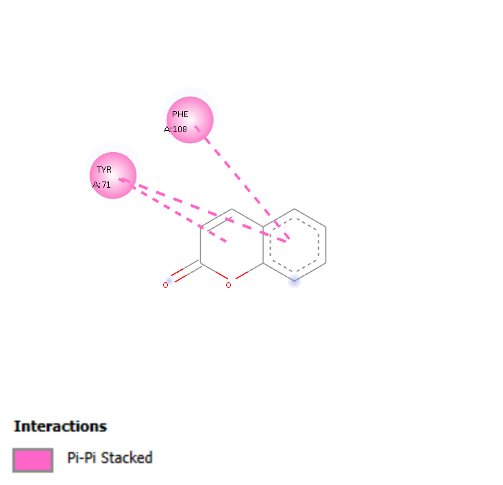

Project Overview: This project involves the retrieval, binding pocket prediction, and structural preparation of the BACE complex for in silico drug discovery

### Retrieval of 3D structure
The proein chosen as an example for assessment is BACE-1 (Beta Secretase-1) which functions in the 
The 3D structure of Beta secretase (BACE) protein imported from Protein Data Bank into PyMol. The pdb id 5QCU was chosen becuase of its resolution 1.95 A. Lower resolutions (<2A) helps to visualize individual atoms clearly. 2-2.5A provides good detail but >3A makes it harder to place atoms precisely. PyMol is a tool used for visualizing secondary structures, identify binding pockets visually.


*Figure 1: Beta-secretase protein structure visualized in PyMol.*

### Determining binding pockets
The binding pockets on the protein was detected using DoG site scorer program in Protein Plus (https://proteins.plus/). The pdb structure was uploaded to Proteins plus and binding pocket with p_val = 0 was identified in the chain A. 


*Figure 2: Binding site detection in Chain A using the DoGsite scorer on Proteins Plus.*

### Protein clean-up
Next, the protein pdb structure was uploaded to Chimera to prepare the protein for docking. Chains B and C, the co-crystallized ligands and the water molecules were removed. The structure was saved in a dockprep format. This preparation is important to add any missing atoms, assign charges, remove bound ligands and water molecules.

### Protein Preparation Results
| Before Cleaning | After Dockprep |
| :---: | :---: |
|  |  |
| *Initial 5QCU complex with water, ligands, and extra chains.* | *Final prepared Chain A isolated and cleaned in Chimera.* |

### Assessing physicochemical properties
Physicochemical properties like molecular weight, lipophilicity, GI aborption, pharmacokinetics determine the drug-likeness of a compound. Three compounds were used for testing.
1) Galantamine- an acetylcholinesterase inhibitor used to treat dementia. It is isolated from the plant Galanthis nivalis
2) Coumarin - an aromatic compound isolated from plants like beans and lavender. It has anti-inflammatory functions
3) Geraniol - another aromatic compound found in the essential oils of many plants. It has anti-inflammatory functions

The SMILES structures of these compounds was obtained from PubChem (See data folder). The SMILES was fed into SWISS-ADME server to determine ADMET properties. 

### Druglikeness screening comparison
| Property | Coumarin | Galantamine | Geraniol |
| :--- | :---: | :---: | :---: |
| **Molecular Weight** | 146.14 g/mol | 287.35 g/mol | 154.25 g/mol |
| **Log P (Lipophilicity)** | 1.82 | 1.92 | 2.74 |
| **GI Absorption** | High | High | High |
| **Lipinski Rule Violations** | 0 | 0 | 0 |
| **BBB Permeant** | Yes | Yes | Yes |

### Docking using PyRx
Docking was performed using PyRx. The structures of the ligands were downloaded in sdf format from PubChem and opened in PyRx. Using Vina wizard, docking was performed on the binding site residues determined from DoG site scorer. The definition of the search space (Grid Box):
```
Grid Center: 
  X: 28.6668
  Y: 6.4795
  Z: 20.2951

Grid Size (Dimensions):
  X: 31.8003 Å
  Y: 26.6275 Å
  Z: 25.1095 Å
  ```
Docking gives a numerical value which represents the binding affinity between the ligand and protein. PyRx calculates binding energy in kcal/mol. It measures the Gibbs free energy of binding, which is the amount of energy released when the ligand binds to the protein. Since it is energy released, it has a negative sign. The lower the value, the lower the energy required for binding and the stronger the affinity.

* -9.0 kcal/mol: very strong binding suggesting a high affinity hit for further investigation
* -7.0 to -8.0 kcal/mol: Good binding. Most drug-like molecules are in this range
* -5.0 to -6.0 kcal/mol: Moderate binding
* -4.0 kcal/mol: Very weak or no binding

### Docking results 

| Name | Ligand | Target | Binding energy kcal/mol |
| :--- | :---: | :---: | :---: |
| Galantamine | 9651_mmff94_E=69.95 | 5QCU_dockprep | -8.3 |
| Coumarin | 323_mmff94_E=33.85 | 5QCU_dockprep | -6.0 |
| Geraniol | 637566_mmff94_E=17.24 | 5QCU_dockprep | -5.8 |

### Interpretation
The results show that Galantamine, the clincally used drug demonstrates strong binding affinity. It has the strongest binding affinity compared to the plant based compounds - coumarin and geraniol, which show moderate binding affinity. Still their drug-likeness properties makes them good candidates for further investigation.

### 2D visualization

The 2D interaction diagram was generated to visualize the non-covalent bond network between the ligand and the BACE1 active site. Galantamine forms a hydrogen bond with Gln73 and Phe108, and a Pi-Alkyl bond with Tyr91. The 3D interaction diagram shows a "lock and key" binding. The aromatic rings of the ligand are positioned near the grey hydrophobic regions, while the polar groups are touching the green "Acceptor" clouds. It uses hydrophobic effects for stability and hydrogen bonds for specificity.



*Figure 3: 2D interaction diagram of Galantamine in BACE1 binding site using the Biovia Discovery Studio.*


Coumarin forms a Pi-Pi stacked bond with Tyr71 and Phe108. The 3D interaction diagram shows that Coumarin exhibits significant pocket occupancy, aligning with both donor and acceptor regions of the BACE1 catalytic site, suggesting a stable binding orientation



*Figure 4: 2D interaction diagram of Coumarin in BACE1 binding site using the Biovia Discovery Studio.*

## Acknowledgments
This project was completed as part of the 3-Week Virtual Research Training in CADD (https://www.linkedin.com/company/the-insilico-lab/posts/?feedView=all) organized by **The InSilico Lab**. 
